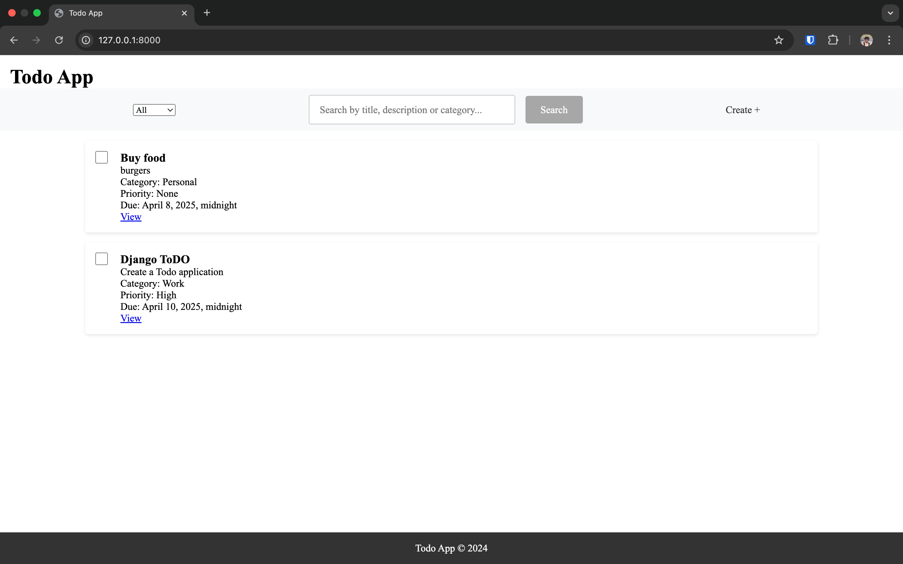
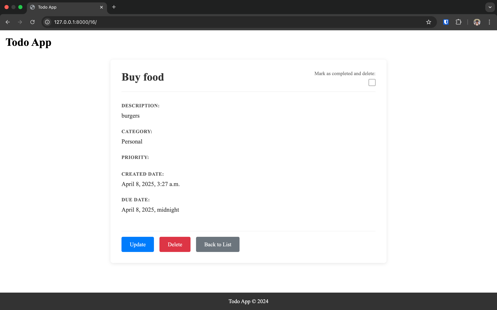
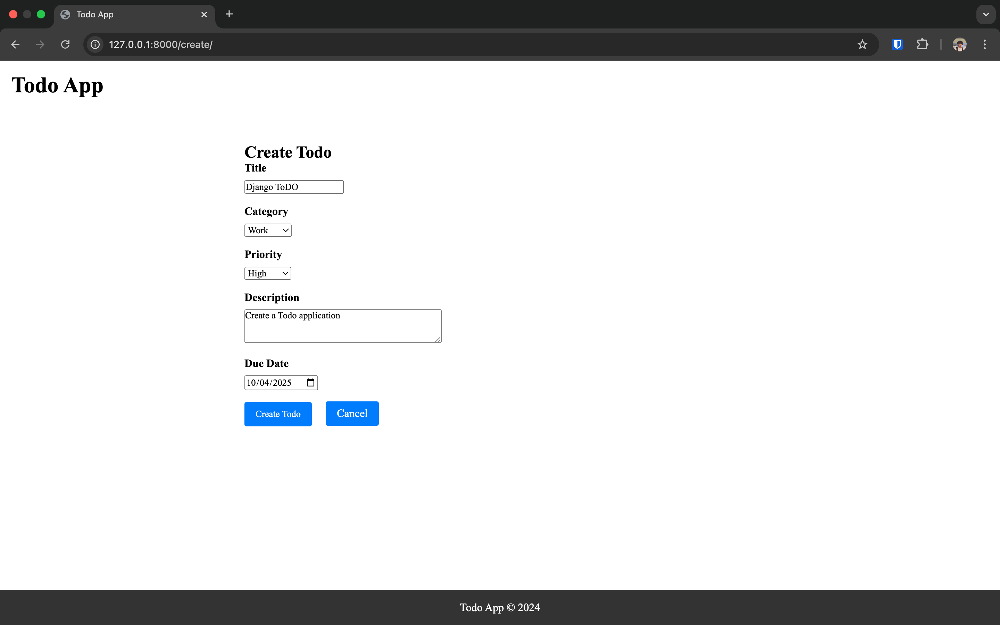
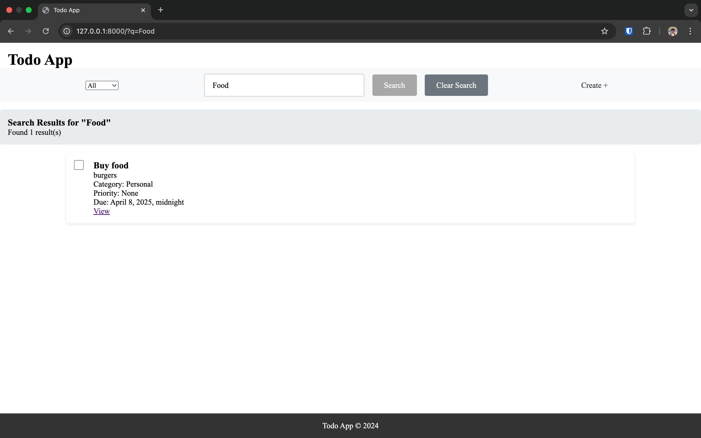
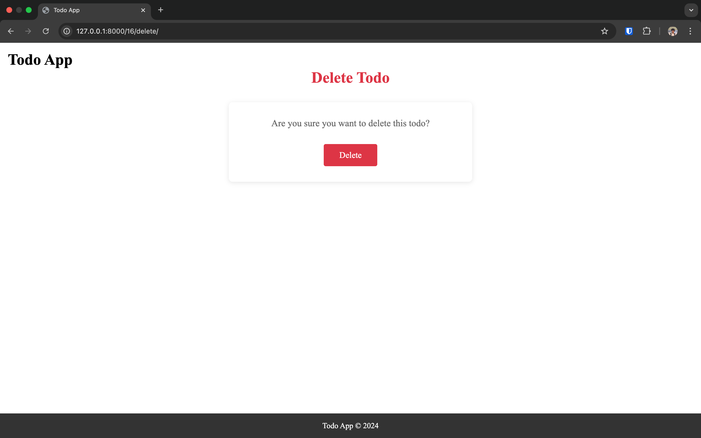

# Todo Application

A modern, feature-rich Todo application built with Django that helps you manage your tasks efficiently.

## Screenshots


*Main todo list view showing all tasks*


*Detailed view of a todo item with all information*


*Form for creating a new todo item*


*Search functionality to find specific tasks*


*Confirmation page for deleting a task*

## Features

- **Task Management**: Create, read, update, and delete tasks
- **Categories**: Organize tasks by categories (Work, School, Personal, Other)
- **Priority Levels**: Set priority for each task
- **Search Functionality**: Search tasks by title
- **Quick Actions**: Mark tasks as completed with a single click

## Technologies Used

- **Backend**: Django 5.0
- **Frontend**: HTML, CSS
- **Database**: SQLite
- **Package Management**: Poetry
- **Additional Libraries**:
  - django-crispy-forms
  - crispy-bootstrap5
  - python-dotenv
  - whitenoise
  - logbook

## Installation

1. Clone the repository:
   ```bash
   git clone https://github.com/yourusername/todo.git
   cd todo
   ```

2. Install dependencies using Poetry:
   ```bash
   poetry install
   ```

3. Activate the virtual environment:
   ```bash
   poetry shell
   ```

4. Run migrations:
   ```bash
   python manage.py migrate
   ```

5. Create a superuser (optional):
   ```bash
   python manage.py createsuperuser
   ```

6. Run the development server:
   ```bash
   python manage.py runserver
   ```

7. Visit `http://127.0.0.1:8000` in your browser

## Usage

- **Create a Task**: Click the "Create +" button and fill in the task details
- **View Tasks**: All tasks are displayed on the home page
- **Filter Tasks**: Use the category dropdown to filter tasks
- **Search Tasks**: Use the search bar to find specific tasks
- **Update Task**: Click the "Update" button on any task
- **Delete Task**: Click the "Delete" button or check the completion checkbox
- **View Details**: Click on a task to view its full details

## Project Structure

```
todo/
├── docs/                  # Documentation and assets
│   ├── todo_list.png     # Screenshot of todo list view
│   ├── todo_detail.png   # Screenshot of todo detail view
│   ├── todo_create.png   # Screenshot of todo create form
│   ├── todo_search.png   # Screenshot of search functionality
│   ├── todo_delete.png   # Screenshot of delete confirmation
│   └── todo_newlist.png  # Additional screenshot
├── main/                  # Main application
│   ├── migrations/        # Database migrations
│   ├── static/           # Static files (CSS, JS)
│   ├── templates/        # HTML templates
│   ├── admin.py          # Admin configuration
│   ├── forms.py          # Form definitions
│   ├── models.py         # Database models
│   ├── urls.py           # URL routing
│   └── views.py          # View logic
├── todo/                  # Project settings
│   ├── settings.py       # Project settings
│   ├── urls.py           # Project URL routing
│   └── wsgi.py           # WSGI configuration
├── manage.py             # Django management script
├── poetry.lock           # Poetry lock file
├── pyproject.toml        # Project dependencies
└── README.md             # Project documentation
```

## Contact

MuratbekJ - [muratbekj2006@gmail.com](mailto:muratbekj2006@gmail.com)

Project Link: [https://github.com/muratbekj/todo](https://github.com/muratbekj/todo) 